# SQSYIIMP — Ethash / Etchash Coin Installation Manual

This manual describes a normalized procedure for installing, registering, validating, and troubleshooting EVM Proof-of-Work coins that use `ethash` or `etchash` with SQSYIIMP.

The instructions are intentionally generic. Replace example values with the values required by the target coin.

## 0. Conventions and environment variables

Define these variables once in your shell before following the command examples:

```bash
export SQSYIIMP_REPO="${SQSYIIMP_REPO:-$HOME/sqsyiimp}"
export YIIMP_ROOT="${YIIMP_ROOT:-/home/crypto-data/yiimp}"
export WALLET_ROOT="${WALLET_ROOT:-/home/crypto-data/wallets}"
export STRATUM_SRC="$YIIMP_ROOT/site/code-stratums/stratum-kawpow-sqs"
export STRATUM_ROOT="$YIIMP_ROOT/site/stratum"
```

The defaults above match a common SQSYIIMP installation. Change them if your installation uses different paths.

Throughout this manual:

```text
<COIN_NAME>       Full coin name
<SYMBOL>          YiiMP ticker / symbol
<IDENTIFIER>      Lowercase filesystem/service identifier
<ALGO>            ethash or etchash
<RPC_PORT>        Local JSON-RPC HTTP port
<P2P_PORT>        Peer-to-peer network port
<STRATUM_PORT>    Dedicated Stratum port
<YIIMP_DATABASE>  YiiMP database name
```

---

## 1. Ethash and Etchash are separate algorithms

Do not rename an existing `ethash` database row to `etchash`.

```text
╭──────────────────── ALGORITHM MODEL ─────────────────────╮
│ Standard Ethash-family coin      → algo = ethash         │
│ Ethereum Classic family          → algo = etchash        │
│ New or unfamiliar EVM coin       → verify PoW upstream   │
│ Existing Ethash coins            → keep ethash unchanged │
╰───────────────────────────────────────────────────────────╯
```

A coin being EVM-compatible does not prove that it uses Ethash or Etchash. Confirm the Proof-of-Work implementation before adding it.

---

## 2. One-time Etchash Stratum integration

Ethash support already exists in the shared Stratum source. Etchash support is installed once per Stratum source/runtime, not once per coin.

Check the integration:

```bash
cd "$SQSYIIMP_REPO"
sudo bash stratum_manager/patches/etchash-etc/install.sh --check
```

A pristine supported source can report:

```text
Source state:    pristine
Bridge compile:  OK
CHECK OK: source matches the supported snapshot.
```

An already-installed source can report:

```text
Source state:    patched
Bridge compile:  OK
CHECK OK: Etchash source patch is already installed.
```

If the source is already `patched`, do not reinstall it.

For a pristine supported source:

```bash
cd "$SQSYIIMP_REPO"
sudo bash stratum_manager/patches/etchash-etc/install.sh
```

Verify the shared runtime:

```bash
strings "$STRATUM_ROOT/stratum-ethash-test" \
  | grep -E '^ethash$|^etchash$|Algorithm engine selected: (ETHASH|ETCHASH)'
```

Expected result: both `ethash` and `etchash` engine markers are present.

---

## 3. Install the EVM node with DaemonBuilder

Start DaemonBuilder:

```bash
daemonbuilder
```

### Step 1 — Select the EVM installer

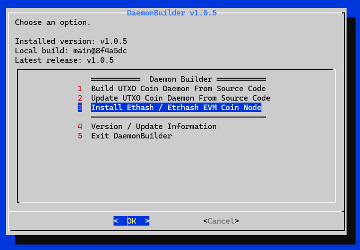

Choose **Install Ethash / Etchash EVM Coin Node**.

### Step 2 — Select the mining algorithm

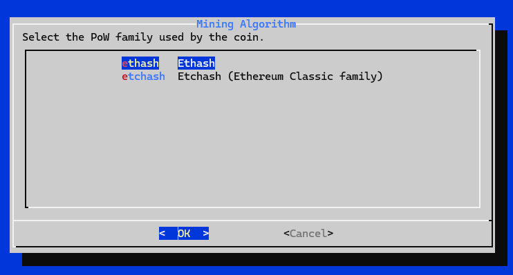

Choose:

```text
ethash   → standard Ethash
etchash  → Ethereum Classic family
```

### Step 3 — Enter the full coin name

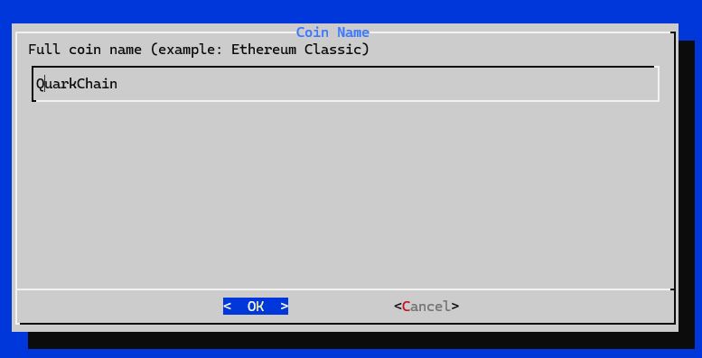

Example values in screenshots are illustrative only.

### Step 4 — Enter the YiiMP symbol

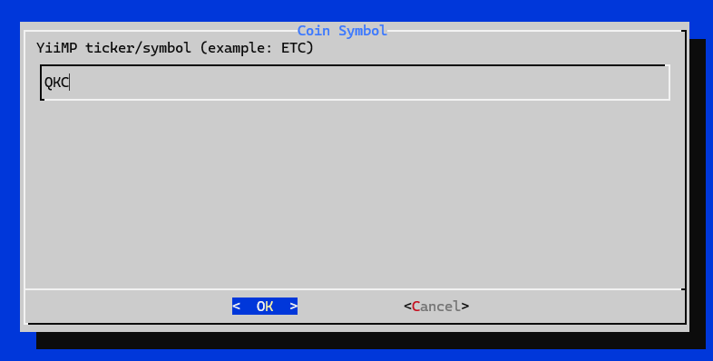

Use the exact ticker that will be stored in YiiMP.

### Step 5 — Enter the identifier

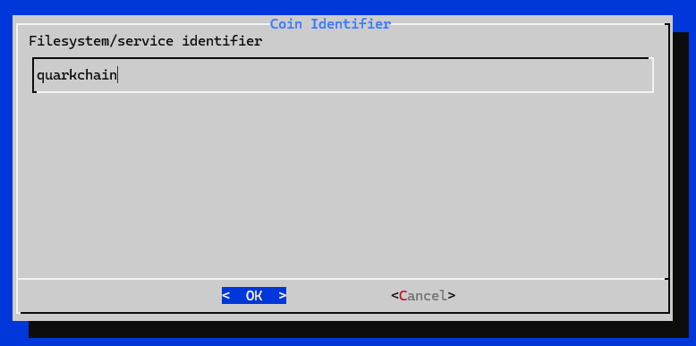

Use a stable lowercase identifier suitable for directories, services, and helper scripts.

Recommended format:

```text
letters and numbers only where practical
no spaces
no temporary version suffixes
```

### Step 6 — Choose how to provide the node binary

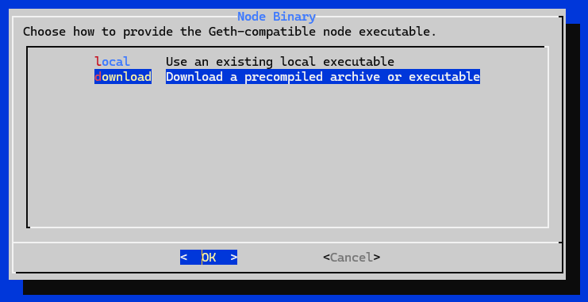

Choose:

```text
local     → executable already exists on the server
download  → download a precompiled archive or executable
```

### Step 7 — Enter the download URL when required

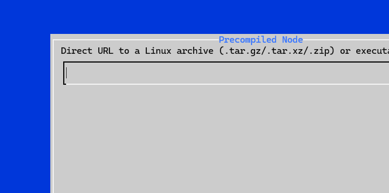

Use a direct Linux archive or executable URL from the project's official release source.

### Step 8 — Enter the binary name

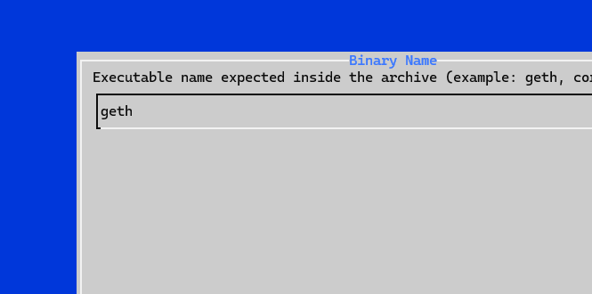

This is the executable expected inside the downloaded package, for example `geth`, `core-geth`, or another Geth-compatible client name.

### Step 9 — Set the JSON-RPC port

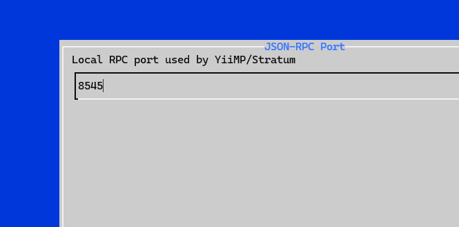

This port is used locally by YiiMP and the Stratum.

### Step 10 — Set the P2P port

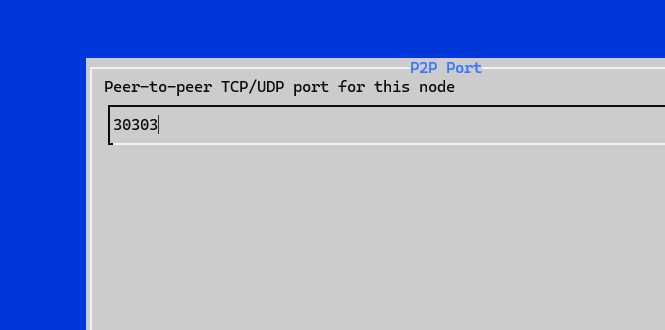

This is the peer-to-peer TCP/UDP port used by the node.

### Step 11 — Set optional network arguments

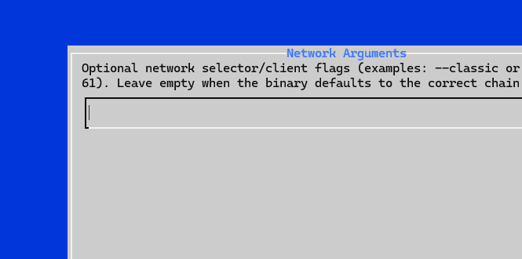

Leave this field empty when the binary defaults to the correct network. Add the required network selector only when the client needs one.

Examples can include options such as:

```text
--classic
--networkid <id>
```

Do not copy a network flag from another coin without verifying it.

---

## 4. Reward wallet and backup policy

Choose whether to use an existing reward address or create a new encrypted wallet.

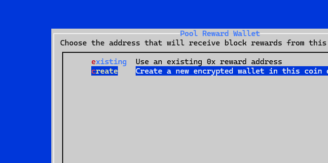

The pool configuration needs the **public `0x...` address**, not the private key or wallet password.

```text
╭──────────────────── WALLET SAFETY ──────────────────────╮
│ Back up the complete keystore directory                │
│ Back up the wallet password separately                 │
│ Do not place the wallet password in YiiMP RPC fields   │
│ Store recovery material outside the mining server      │
╰─────────────────────────────────────────────────────────╯
```

List accounts for a typical Geth-compatible client:

```bash
sudo -u crypto-data \
  /usr/bin/<IDENTIFIER>-geth \
  --datadir "$WALLET_ROOT/.<IDENTIFIER>" \
  account list
```

Adjust the executable name if the installed node uses a different suffix.

---

## 5. Synchronization and optional node settings

### Synchronization mode

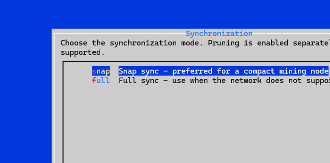

Use `snap` when the client and network support it and a compact mining node is preferred. Use `full` when required by the network or client.

### Additional runtime arguments

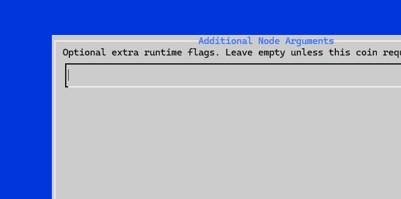

Leave this empty unless the target coin explicitly requires additional flags.

### Optional genesis file or URL

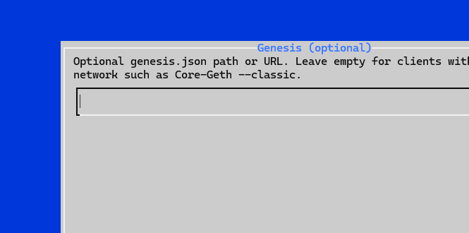

Leave this empty when the client has the network configuration built in. Supply a genesis only when the chain requires an external genesis file or URL.

### Start the node and enable it at boot

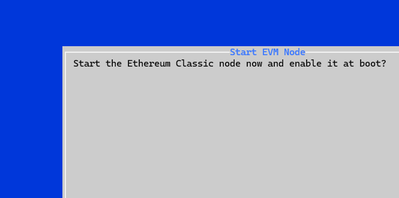

For a dedicated pool node, enabling the service at boot is normally appropriate.

---

## 6. Validate the node and RPC

The local JSON-RPC endpoint should normally bind to localhost:

```text
--http
--http.addr 127.0.0.1
--http.port <RPC_PORT>
--http.api eth,net,web3
```

Check listening ports:

```bash
sudo ss -lntp | grep ':<RPC_PORT>'
sudo ss -lntup | grep ':<P2P_PORT>'
```

Typical helper commands:

```bash
/usr/bin/<IDENTIFIER>-rpc eth_blockNumber
/usr/bin/<IDENTIFIER>-rpc eth_syncing
/usr/bin/<IDENTIFIER>-rpc net_peerCount
/usr/bin/<IDENTIFIER>-rpc eth_getWork
```

The node is ready for production mining only when `eth_syncing` returns:

```json
{"jsonrpc":"2.0","id":1,"result":false}
```

`eth_getWork` returning data while the node is still syncing is not sufficient to declare the node ready.

---

## 7. Register Ethash and Etchash separately in YiiMP

Set the database name:

```bash
export DB="<YIIMP_DATABASE>"
```

Inspect the algorithm rows:

```bash
sudo mariadb "$DB" -e "
SELECT id,name,profit,rent,factor,overflow,norm,speedfactor,port,visible
FROM algos
WHERE name IN ('ethash','etchash')
ORDER BY name;
"
```

Never do this:

```sql
UPDATE algos SET name='etchash' WHERE name='ethash';
```

If `ethash` exists and `etchash` does not, create a separate Etchash row:

```bash
sudo mariadb "$DB" <<'SQL'
START TRANSACTION;

INSERT INTO algos
(
    name, profit, rent, factor, overflow, norm,
    color, speedfactor, port, visible, powlimit_bits
)
SELECT
    'etchash', 0, 0, factor, overflow, norm,
    color, speedfactor, port, visible, powlimit_bits
FROM algos
WHERE name='ethash'
  AND NOT EXISTS (
      SELECT 1 FROM algos WHERE name='etchash'
  )
LIMIT 1;

COMMIT;
SQL
```

Assign the intended algorithm only to the target coin:

```sql
UPDATE coins
SET algo='<ALGO>'
WHERE symbol='<SYMBOL>';
```

Verify:

```bash
sudo mariadb "$DB" -e "
SELECT id,symbol,name,algo
FROM coins
WHERE algo IN ('ethash','etchash')
ORDER BY algo,symbol;
"
```

If an example query fails because a column does not exist, inspect the live schema first:

```bash
sudo mariadb "$DB" -e "DESCRIBE coins; DESCRIBE algos;"
```

Do not assume every YiiMP fork has identical columns.

---

## 8. Configure the coin in the YiiMP administration panel

Use values that match the node that was actually installed.

```text
╭──────────────────── DAEMON / RPC ───────────────────────╮
│ Algorithm              <ALGO>                           │
│ Daemon program         /usr/bin/<node-binary>           │
│ Data/config folder     .<IDENTIFIER>                    │
│ Daemon OS user         crypto-data                      │
│ RPC host               127.0.0.1                        │
│ RPC port               <RPC_PORT>                       │
│ Dedicated Stratum      <STRATUM_PORT>                   │
│ RPC username           [empty when not required]        │
│ RPC password           [empty when not required]        │
│ Wallet account         0x...                            │
╰─────────────────────────────────────────────────────────╯
```

For a local Geth/Core-Geth-style HTTP endpoint without Basic authentication, leave the RPC username and password empty.

Do not use the keystore password as the RPC password.

---

## 9. Create the Stratum port with `addport`

Run:

```bash
/usr/bin/addport
```

A normalized Ethash/Etchash flow is:

```text
╭──────────────────────── ADDPORT FLOW ────────────────────────╮
│ 1. Select ethash or etchash                                  │
│ 2. Select the shared Ethash-family runtime                   │
│ 3. Configure NiceHash profile if required                    │
│ 4. Configure MiningRigRentals profile if required            │
│ 5. Choose automatic or manual dedicated Stratum port         │
│ 6. Generate the coin configuration                           │
│ 7. Start the managed Stratum only when the node is ready     │
╰───────────────────────────────────────────────────────────────╯
```

The current shared runtime can be:

```text
stratum-ethash-test
```

The generated configuration normally follows:

```text
$STRATUM_ROOT/config/<coin>.<algo>.conf
```

Example structure:

```ini
[TCP]
server = pool.example.org
port = <STRATUM_PORT>
password = <generated-secret>

[SQL]
host = localhost
database = <YIIMP_DATABASE>
username = <STRATUM_DB_USER>
password = <STRATUM_DB_PASSWORD>

[STRATUM]
algo = <ALGO>
difficulty = <initial-difficulty>
diff_min = <minimum>
diff_max = <maximum>
max_ttf = <target-time-to-find>

[WALLETS]
include = <SYMBOL>

[RUNTIME]
binary = stratum-ethash-test
```

Do not publish real SQL or TCP secrets from a production configuration.

### Marketplace difficulty profiles

If marketplace compatibility is needed, treat suggested values as starting profiles rather than permanent constants.

Example template:

```text
NiceHash: initial=2,   min=2,   max=2048
MRR:      initial=0.1, min=0.1, max=102.4
```

Adjust values after observing the actual miner, hashrate, share rate, rejects, and session behavior.

---

## 10. Validate the generated Stratum configuration

Inspect the file:

```bash
sudo cat "$STRATUM_ROOT/config/<coin>.<algo>.conf"
```

There should be only one `[WALLETS]` section:

```bash
grep -n '^\[WALLETS\]' \
  "$STRATUM_ROOT/config/<coin>.<algo>.conf"
```

Expected:

```ini
[WALLETS]
include = <SYMBOL>
```

Also confirm:

```text
algo = ethash    or    algo = etchash
runtime binary = shared Ethash-family runtime
coin symbol included in [WALLETS]
correct dedicated Stratum port
```

---

## 11. Start and validate the Stratum

Keep the Stratum stopped while the node is still syncing.

Once `eth_syncing` returns `false`:

```bash
/usr/bin/stratum.<coin> start
sleep 3
/usr/bin/stratum.<coin> status
sudo tail -n 100 /var/log/stratum-<coin>.log
```

Expected Ethash engine marker:

```text
Algorithm engine selected: ETHASH (...)
```

Expected Etchash engine marker:

```text
Algorithm engine selected: ETCHASH (...)
```

The log should not loop with:

```text
ERROR: 13 invalid algo
```

---

## 12. Troubleshooting

### `ERROR: 13 invalid algo`

The runtime does not recognize the configured algorithm.

Check the runtime:

```bash
strings "$STRATUM_ROOT/stratum-ethash-test" \
  | grep -E '^ethash$|^etchash$|Algorithm engine selected: (ETHASH|ETCHASH)'
```

Check the source patch:

```bash
cd "$SQSYIIMP_REPO"
sudo bash stratum_manager/patches/etchash-etc/install.sh --check
```

Check all three algorithm references:

```text
coins.algo
[STRATUM] algo = ...
runtime engine support
```

They must agree.

### `eth_syncing` returns an object

The node is still synchronizing. Keep the Stratum stopped.

### `eth_getWork` returns data while syncing

This does not prove that the node is production-ready. Wait until `eth_syncing` returns `false`.

### No peers

```bash
/usr/bin/<IDENTIFIER>-rpc net_peerCount
sudo ss -lntup | grep ':<P2P_PORT>'
sudo journalctl -u sqsyiimp-<IDENTIFIER>-node.service -n 100 --no-pager
```

### Duplicate `[WALLETS]` sections

```bash
grep -n '^\[WALLETS\]' \
  "$STRATUM_ROOT/config/<coin>.<algo>.conf"
```

Keep only one valid section.

### `Text file busy` when replacing a runtime binary

Do not manually overwrite an executable that is actively mapped by a running process. Use the provided installer/deployment flow. If performing manual maintenance, stop the relevant Stratum process first.

```bash
/usr/bin/stratum.<coin> status
ps -ef | grep '[s]tratum-ethash-test'
```

### YiiMP RPC fields do not match a Geth-style node

For a local node without HTTP Basic authentication:

```text
RPC host      127.0.0.1
RPC port      node HTTP RPC port
RPC username  empty
RPC password  empty
Wallet        public 0x address
```

### SQL example fails because a column is missing

```bash
sudo mariadb "$DB" -e "DESCRIBE coins; DESCRIBE algos;"
```

### Minimum go-live test

```bash
/usr/bin/<IDENTIFIER>-rpc eth_syncing
/usr/bin/<IDENTIFIER>-rpc eth_getWork
/usr/bin/stratum.<coin> status
sudo tail -n 100 /var/log/stratum-<coin>.log
```

Expected state:

```text
eth_syncing = false
eth_getWork returns work
Stratum = RUNNING
correct engine marker is present
no invalid-algo loop
```

---

## 13. Ethereum Classic example

Ethereum Classic is a useful reference for an Etchash deployment:

```text
╭────────────────── ETHEREUM CLASSIC ─────────────────────╮
│ Identifier      ethereumclassic                         │
│ Algorithm       etchash                                 │
│ RPC             127.0.0.1:8545                         │
│ P2P             30303                                   │
│ Network args    --classic                               │
│ Sync mode       snap                                    │
╰─────────────────────────────────────────────────────────╯
```

Typical checks:

```bash
sudo systemctl status sqsyiimp-ethereumclassic-node.service --no-pager
/usr/bin/ethereumclassic-rpc eth_blockNumber
/usr/bin/ethereumclassic-rpc eth_syncing
/usr/bin/ethereumclassic-rpc net_peerCount
/usr/bin/ethereumclassic-rpc eth_getWork
/usr/bin/stratum.etc status
sudo tail -n 100 /var/log/stratum-etc.log
```

Do not reuse ETC-specific arguments for another coin unless its upstream documentation requires them.

---

## 14. Service lifecycle and removal

Status:

```bash
/usr/bin/stratum.<coin> status
```

Stop:

```bash
/usr/bin/stratum.<coin> stop
```

Restart:

```bash
/usr/bin/stratum.<coin> restart
```

Preview removal:

```bash
/usr/bin/removecoin <SYMBOL> --check --purge-node
```

Review the generated plan before performing the final removal.

---

## 15. Final checklist

```text
╭──────────────────────── FINAL CHECKLIST ────────────────────────╮
│ [ ] Upstream PoW algorithm verified                            │
│ [ ] Correct ethash / etchash selection                         │
│ [ ] Node service active                                       │
│ [ ] P2P port listening                                        │
│ [ ] Peers connected                                           │
│ [ ] JSON-RPC reachable on localhost                           │
│ [ ] eth_syncing returns false                                 │
│ [ ] Public reward address configured                          │
│ [ ] Keystore and password backed up safely                    │
│ [ ] coins.algo is correct                                     │
│ [ ] Existing Ethash coins still use ethash                    │
│ [ ] Etchash exists separately when required                   │
│ [ ] addport used the correct algorithm and runtime            │
│ [ ] Dedicated Stratum port configured                         │
│ [ ] Only one [WALLETS] section exists                         │
│ [ ] Runtime contains the required engine marker               │
│ [ ] Stratum log has no invalid-algo loop                      │
│ [ ] Real miner connection tested before public launch         │
╰─────────────────────────────────────────────────────────────────╯
```

---

## 16. Repository layout

```text
docs/
├── ETHASH-ETCHASH-MANUAL.md
└── images/
    ├── 01-daemonbuilder-menu.png
    ├── 02-mining-algorithm.png
    ├── ...
    └── 16-start-node.png

stratum_manager/
├── README.md
└── patches/
    └── etchash-etc/
        ├── README.md
        ├── SHA256SUMS
        ├── install.sh
        ├── files/
        ├── patches/
        └── tests/
```

Keep this manual synchronized with changes to DaemonBuilder, `addport`, the runtime binary name, database workflow, and EVM-node service generation.
